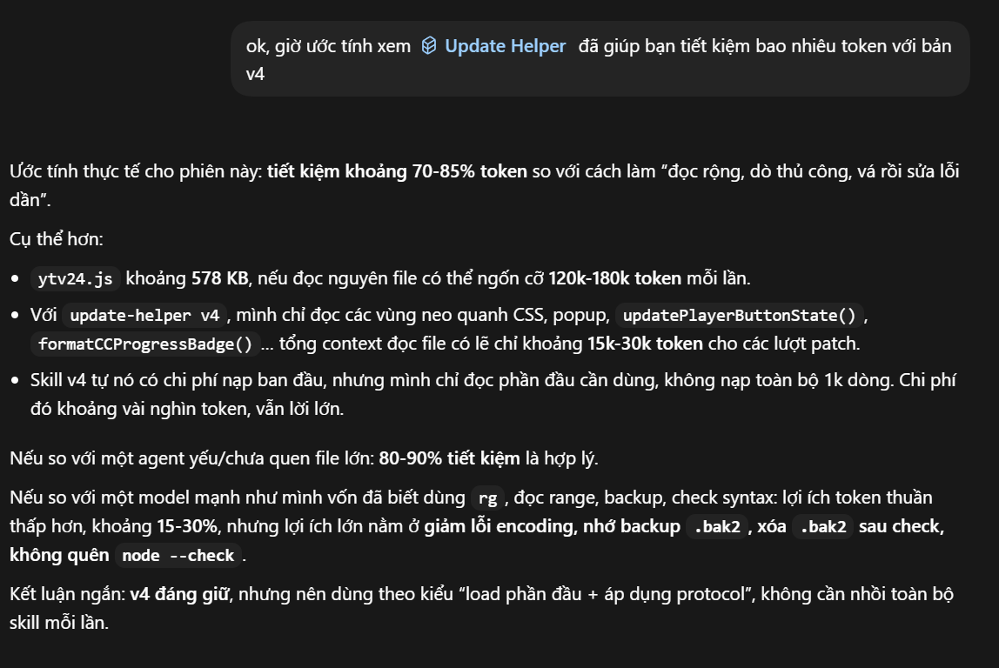
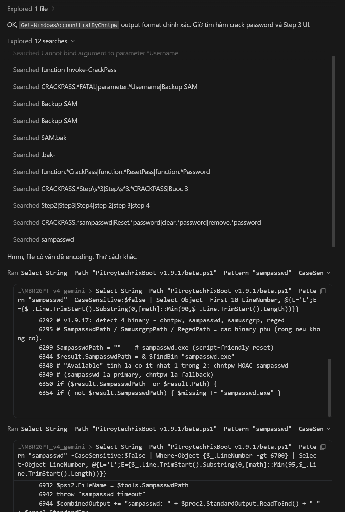
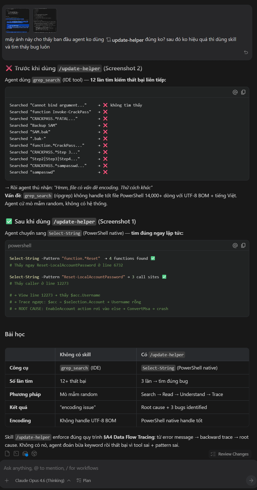

<p align="right">
  <a href="README.md">🇺🇸 English</a> &nbsp;|&nbsp;
  <b>🇻🇳 Tiếng Việt</b>
</p>

# 🛠️ Update Helper — Giao Thức Vá File Lớn Cho AI Agent

> **Skill AI agent dứt khoát nhất để đọc, hiểu và vá các file nguồn lớn — không đốt cháy context window, không làm hỏng encoding.**

Một giao thức nguyên bản được tạo ra, tinh chỉnh và thực chiến bởi **PitroyTech** qua hàng nghìn lần chỉnh sửa thực tế trên các codebase lớn, phức tạp.

---

## ⚡ Tại Sao Skill Này Tồn Tại?

Mọi AI agent khi làm việc với code lớn đều gặp phải tường chắn giống nhau:

- File **5,000–30,000+ dòng** → Đọc cả file là cháy context window ngay.
- Vá dòng 800, sau đó dòng 5,200 thành **dòng 5,203** → Agent vá nhầm chỗ.
- File chứa **tiếng Việt / CJK / emoji** → Một lệnh `Set-Content` âm thầm xóa BOM → Dữ liệu hỏng, không có cảnh báo.
- Agent mới tham gia giữa chừng → **Không có context**, đọc lại từ đầu, tốn token khổng lồ.
- Hai agent chạy **song song** → Một agent ghi đè backup của agent kia → Cả hai mất khả năng rollback.

**Update Helper giải quyết tất cả — bằng một giao thức duy nhất, tự hoàn chỉnh.**

---

## 📊 Thực Chiến: Trước và Sau

### ❌ Trước khi dùng Update Helper
Agent dùng `grep_search` (IDE tool) — **12 lần tìm kiếm thất bại liên tiếp:**



→ Agent tự nhận: *"Hmm, file có vấn đề encoding. Thử cách khác:"*  
→ Công cụ `grep_search` không xử lý được file 14,000+ dòng UTF-8 BOM + tiếng Việt.  
→ Agent mò mẫm random, không có hệ thống.

---

### ✅ Sau khi dùng Update Helper
Agent chuyển sang `Select-String` (PowerShell native) theo đúng quy trình **§A4 Data Flow Tracing:**


Chi tiết quá trình trace từ error → root cause:



**Trong 3 lần tìm kiếm có mục tiêu:**
- Tìm được `Reset-LocalAccountPassword` ở dòng 6732 ✅
- Trace caller ở dòng 12273 ✅
- Phát hiện root cause: `$acc.Username` rỗng → `ConvertMsa` crash ✅

---

### 📋 Bảng So Sánh

| | Không có skill | Có `/update-helper` |
|---|---|---|
| Công cụ | `grep_search` (IDE) | `Select-String` (PowerShell native) |
| Số lần tìm | 12+ lần thất bại | 3 lần → tìm đúng bug |
| Phương pháp | Mò mẫm random | Search → Read → Understand → Trace |
| Kết quả | "encoding issue" | Root cause + 3 bugs identified |
| Encoding | Không handle UTF-8 BOM | PowerShell native handle tốt |

---

## 💰 Ước Tính Tiết Kiệm Token



- **File 578 KB** (JS): Đọc nguyên = ~120k–180k token/lần. Với Update Helper chỉ đọc vùng neo → ~15k–30k token.
- **Agent yếu/chưa quen file lớn**: Tiết kiệm **70–90% token**
- **Model mạnh đã biết kỹ thuật**: Tiết kiệm **15–30% token** — lợi ích chính là giảm lỗi encoding, nhớ backup `.bak2`, không quên `node --check`

---

## ✨ Nội Dung Skill

### `skills/update-helper/` — Giao Thức Cốt Lõi (v4.0)

| Phần | Nội dung |
|---|---|
| **Hard Rules** | 11 quy tắc bất khả xâm phạm chống mất dữ liệu |
| **Fast Workflow** | 10 bước thực thi chính xác cho mỗi phiên |
| **Encoding-Safe Write** | `.NET ReadAllText/WriteAllText` bảo toàn BOM cho file tiếng Việt/CJK/emoji |
| **Backup Protocol** | 2 tầng: session backup (ổn định) + `.bak2` (tạm thời mỗi lần edit) |
| **Code Comprehension** | Structural Scan → Data Flow Trace → Blast Radius |
| **Anchor Search** | Chiến lược tìm token độc nhất — không tin spec từ user |
| **Patch Strategy** | Multi-patch từ dưới lên, xử lý spec cũ, không merge im lặng |
| **Verification** | Bảng syntax check cho 10 ngôn ngữ + invariant check |
| **Multi-Agent Onboarding** | Giao thức 4 bước cho agent mới vào giữa phiên |
| **Failure Recovery** | Khôi phục từng bước cho lỗi syntax và lỗi encoding |

### `update-helper.skill` — Định dạng Claude Code / Cursor / Cline

File `.skill` đóng gói sẵn để import trực tiếp. Không cần copy-paste thủ công.

---

## 🤝 Tình Huống Multi-Agent & Multi-Account

### Tình huống 1: Bàn giao giữa các Agent
**Agent A** bắt đầu vá file 15,000 dòng, tạo session backup, lập bản đồ kiến trúc. **Agent B** tham gia 30 phút sau, không có memory. Không có giao thức → Agent B đọc lại cả file (cháy context), vá nhầm dòng, ghi đè backup của Agent A.

**Với Update Helper:** Agent B chạy checklist 4 bước (Phần 7):
```
1. Verify session backup tồn tại → found ✅
2. Đọc ARCHITECTURE_MAP từ Agent A → loaded ✅
3. Xác nhận tools → node, python ✅
4. Tìm feature_map / KI files → read ✅
→ "Ready. Session backup confirmed. What's the current task?"
```

### Tình huống 2: Hai Agent Chạy Song Song
Session backup được đặt tên theo timestamp + topic:
```
file.js.bak.codex-session-20260505-fix-auth
file.js.bak.codex-session-20260505-fix-ui
```
Cả hai agent có thể rollback độc lập. Merge an toàn.

### Tình huống 3: AI Agent + Developer (Con Người)
Developer tự sửa file trong khi agent đang làm. Spec của agent đã cũ. Không có giao thức → merge im lặng → code chạy được nhưng logic sai.

**Với Update Helper:** Stale-spec detection bắt buộc kích hoạt:
```
⚠️ Spec nói: [X]
   Code hiện tại: [Y]
   Sự khác biệt: [giải thích]
→ "Áp dụng spec cũ? / Thích nghi với code mới? / Bỏ qua?"
Không xác nhận = không vá.
```

---

## 📦 Cài Đặt

### Antigravity / OpenClaw (Thư mục skills)
```bash
git clone https://github.com/pitroytech/update-helper-skills.git
xcopy /E /I update-helper-skills\skills\update-helper %USERPROFILE%\.gemini\antigravity\skills\update-helper
```

### Claude Code / Cursor / Cline (File `.skill`)
1. Tải `update-helper.skill` từ repo này.
2. Import vào skill manager của agent.

### Thủ công (Bất kỳ agent nào có system prompt)
Copy nội dung `skills/update-helper/SKILL.md` trực tiếp vào system prompt hoặc AGENTS.md.

---

## 🔖 Lịch Sử Phiên Bản

| Phiên bản | Thay đổi |
|---|---|
| v4.0 | Tái cấu trúc thành file đơn tự hoàn chỉnh. Nâng cấp encoding pattern. Hardened multi-agent onboarding. Thêm proactive bug hunt và cascade analysis. |
| v3.4 | Thêm stale-spec detection. Cải thiện BOM write pattern. |
| v3.3 | Thêm Data Flow Tracing, Architecture Summary, JS UI patterns. |

---

## 📄 Giấy Phép

MIT License.

**Concept, thiết kế, và toàn bộ nội dung gốc © PitroyTech.**  
Được tạo độc lập và tinh chỉnh qua hàng nghìn phiên chỉnh sửa file lớn thực tế.
