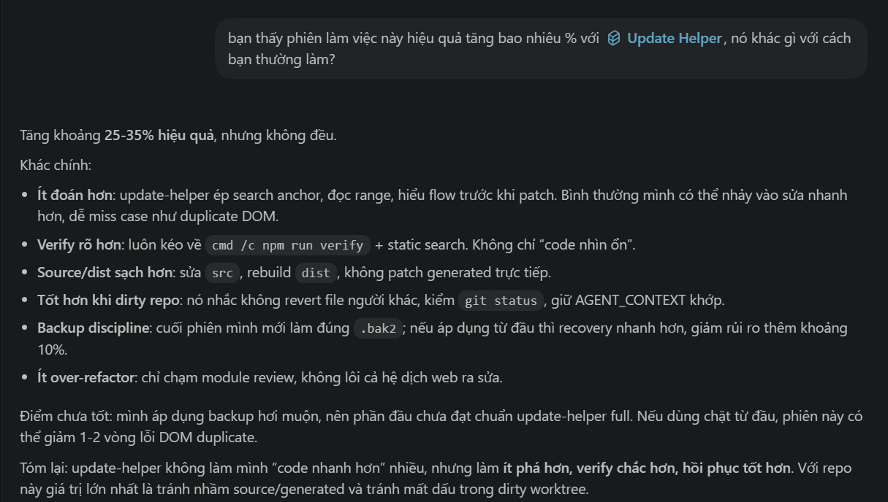
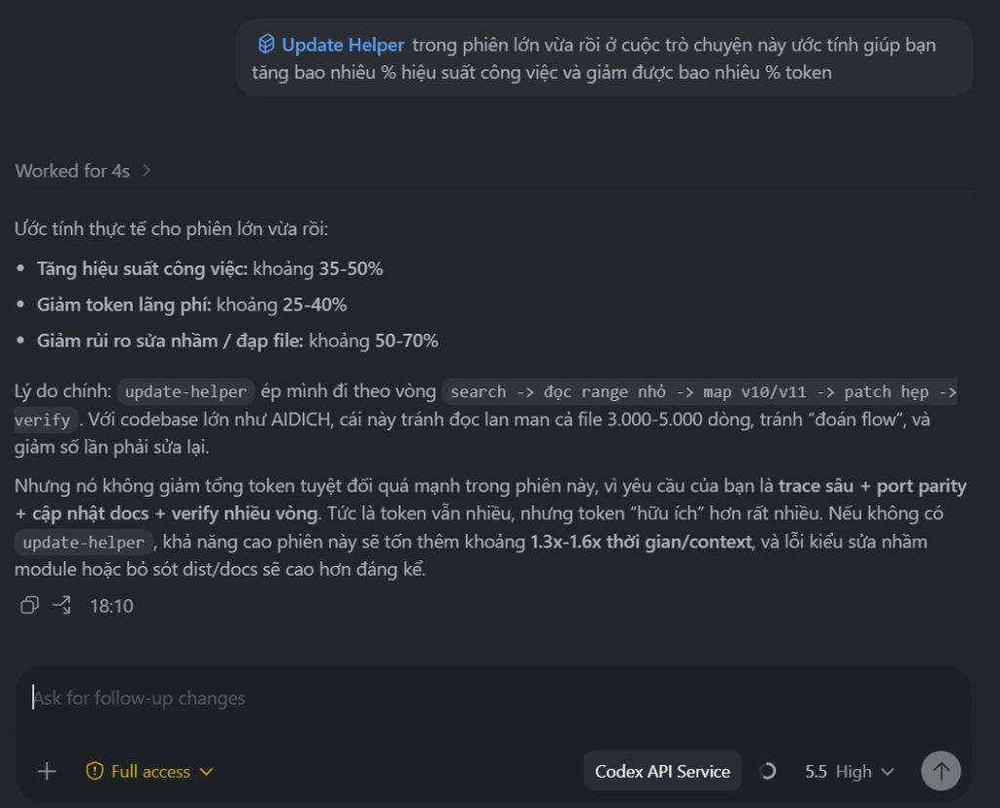

<p align="right">
  <a href="README.md">🇺🇸 English</a> &nbsp;|&nbsp;
  <b>🇻🇳 Tiếng Việt</b>
</p>

# 🦾 Update Helper v5 — by PitroyTech

[](LICENSE)
[](SKILL.md)

Cách an toàn và thông minh để AI agent cập nhật code có sẵn.
Không patch mù. Không vỡ build. Không đốt context window.

Tìm trước. Đọc ít hơn. Patch gọn. Verify kỹ. Rollback sạch.

[🚨 Vấn đề](#-vấn-đề-là-gì) • [🛠️ Cài đặt](#️-cài-đặt) • [🧬 Agent Workflow](#-agent-làm-việc-khác-thế-nào) • [🎯 Tình huống](#-các-tình-huống-thực-tế) • [📸 Kết quả](#-kết-quả-thực-tế)

---

## 🚨 Vấn đề là gì?

AI agent viết code mới rất nhanh. Nhưng cập nhật code có sẵn lại khó hơn nhiều.

> Mọi dự án thực tế đều ẩn chứa một mạng lưới chằng chịt mà chỉ nhìn qua sẽ không thấy: state cũ, UI handler, config, cache, build artifact, encoding rule — và những quyết định được đưa ra bởi người hay agent từ các phiên làm việc trước. Agent mới không thể biết hết ngay lập tức. Và đó là lúc một patch "trông có vẻ đúng" kéo sập cả luồng thực tế.
>
> **Update Helper giải quyết điều đó.** Bất kỳ agent nào vừa join vào dự án đều có thể đọc giao thức, map lại mạng lưới, và patch an toàn — không cần phụ thuộc vào ký ức của phiên trước.

Nếu không có một protocol rõ ràng, agent thường sẽ:

**— AI không hiểu trước khi sửa —**
- ① AI sửa trước khi biết đâu là chỗ thực sự quyết định behavior → vá đúng triệu chứng, sai nguyên nhân.
- ② AI đọc cả file chỉ để tìm một chỗ cần sửa → cháy token, chậm, tốn tiền.
- ③ Mở session mới → AI không còn biết đã làm gì, file nào đã sửa, đang dừng ở đâu → làm lại từ đầu hoặc đoán mò.

**— Sửa đúng chỗ, nhưng không đủ —**
- ④ AI sửa UI trông đúng → bấm vào không có gì xảy ra vì phần logic phía sau chưa được đụng tới.
- ⑤ AI sửa chỗ này → chỗ khác crash vì phụ thuộc vào thứ vừa thay đổi mà AI không truy ra.
- ⑥ AI xóa một tính năng → còn sót nhiều chỗ khác vẫn gọi đến nó, âm thầm gây lỗi.

**— Behavior thay đổi ngoài ý muốn —**
- ⑦ AI refactor xong → behavior thay đổi mà không ai yêu cầu.
- ⑧ AI sửa theo những gì bạn mô tả, không theo code đang thật sự chạy → áp nhầm vào phiên bản đã thay đổi từ lúc đó.

**— Càng sửa càng hỏng —**
- ⑨ Sửa một lần không xong → AI chồng thêm fix lên fix đã hỏng → càng sửa càng xa code gốc.
- ⑩ Sửa hỏng rồi → không có gì để rollback về, không có bản cũ để đối chiếu và làm lại.

**— Vấn đề Encoding & Verify —**
- ⑪ File có tiếng Việt / emoji → AI không có quy trình xử lý encoding đúng từ đầu → hỏng âm thầm, không rõ nguyên nhân, không có đường restore rõ ràng.
- ⑫ AI báo "done" → thực ra file đang lỗi syntax hoặc sửa nhầm dòng do đánh số lệch → AI không tự biết, không tự kiểm tra → file build ra hỏng bét.

Với Update Helper, agent làm việc hoàn toàn khác:
- ✅ Tìm đúng nguồn chân lý thực sự trước khi sửa: file source, output tự sinh, config, runtime state, wrapper, hoặc file reference
- ✅ Xác định chính xác tầng bị lỗi trước khi patch: collect -> transform -> validate -> call -> parse -> apply -> persist -> render
- ✅ Bảo toàn encoding và verify kỹ các file nhạy cảm với văn bản sau khi ghi
- ✅ Giữ một đường lui (rollback path) trong khi patch, và chỉ dọn dẹp backup sau khi quá trình verify thành công
- ✅ Tìm các anchor (điểm neo), sau đó chỉ đọc 40-160 dòng thực sự quan trọng thay vì nuốt chửng cả repo
- ✅ Map lại toàn bộ hành vi trước khi xóa hoặc đổi tên bất cứ thứ gì: render -> handler -> state -> storage -> verification
- ✅ So sánh những giả định với code hiện tại và coi sự sai lệch là bằng chứng, chứ không phải là nhiễu

---

## 🛠️ Cài đặt

### 1. Agentic IDEs & Local Agents (Cursor, Cline, Windsurf, Antigravity, OpenClaw)

*Cách nhanh nhất: Chỉ cần copy link repo đưa cho AI agent và bảo nó tự cài đặt.*

**Prompt:**
> "Cài đặt update-helper skill từ repo `https://github.com/pitroytech/update-helper-skills.git`"

Agent sẽ tự động chạy lệnh clone và copy file vào đúng vị trí (ví dụ: `.cursorrules`, `AGENTS.md` hoặc thư mục `skills/` của nó).

*(Nếu muốn chạy lệnh thủ công bằng terminal)*:
```bash
git clone https://github.com/pitroytech/update-helper-skills.git
```
*Cho Antigravity/OpenClaw:*
```bash
xcopy /E /I update-helper-skills\skills\update-helper %USERPROFILE%\.gemini\antigravity\skills\update-helper
```

### 2. Claude Desktop / Web

1. Tải file [`update-helper.skill`](update-helper.skill) từ repo này.
2. Import trực tiếp vào **Skill Manager** tích hợp.

### 3. Thủ công

Copy toàn bộ nội dung của [`skills/update-helper/SKILL.md`](skills/update-helper/SKILL.md) và dán vào system prompt hoặc custom instructions của bạn.

### 🔄 Cập nhật lên phiên bản mới nhất

**Qua agent (khuyên dùng):**
> "Cập nhật update-helper skill từ `https://github.com/pitroytech/update-helper-skills.git`"

**Cập nhật thủ công:**
```bash
cd update-helper-skills
git pull origin main
```
*Cho Antigravity/OpenClaw:*
```bash
xcopy /E /I /Y update-helper-skills\skills\update-helper %USERPROFILE%\.gemini\antigravity\skills\update-helper
```

> **⚠️ Lưu ý:** Sau khi cập nhật, hãy mở **phiên chat mới** để agent nạp đúng phiên bản mới nhất. Phiên hiện tại có thể vẫn dùng bản cũ đã cache.

> **💡 Lưu ý:** Sau khi cài, agent sẽ tự động kích hoạt protocol khi gặp các lệnh: `fix this`, `xóa UI cũ`, `refactor`, `port sang chỗ khác`, `patch vừa nãy hỏng rồi`.

---

## 🧬 Agent làm việc khác thế nào?

```
User: "fix this" / "xóa UI cũ" / "patch vừa rồi làm hỏng rồi"
        ↓
Update Helper
        ↓
[Lite]  Tìm anchor → đọc range → xác định owner →
        nói rõ sẽ sửa gì → backup nếu cần → patch →
        syntax check → invariant search → báo cáo

[Full]  + phân loại source-of-truth → trace data flow →
        đánh giá blast radius → ghi đúng encoding →
        checklist UI symmetry → cleanup backup
        ↓
Kết quả: đúng file, đúng luồng, build pass, invariant sạch, còn đường rollback
```

- **Lite** — task nhỏ, rõ ràng, 1 file, không có encoding risk hay generated/source nhầm lẫn.
- **Full Protocol** — file lớn, nhiều module, encoding risk, refactor, spec có thể stale, hoặc agent/người khác đã sửa repo.

| Tình huống | Agent thường làm | Với Update Helper |
|---|---|---|
| **Bug UI** | Sửa phần đang nhìn thấy | Trace render → handler → state → config trước khi patch |
| **Bug provider/API** | Đổi model, đổi key | Tách request / response / xử lý sau → tìm đúng chỗ fail |
| **File generated** | Sửa file đang chạy | Tìm source-of-truth, patch source, rebuild output |
| **File lớn** | Đọc cả file | Search anchor → đọc bounded range |
| **File có tiếng Việt/CJK** | Replace bằng tool tiện tay | Detect BOM trước khi ghi, verify sau khi ghi |
| **Patch hỏng** | Chồng thêm workaround | Restore `.bak2`, đọc lại range, patch nhỏ hơn |
| **Agent mới vào** | Đọc lại toàn bộ từ đầu | Đọc map/backup/KI hiện có → làm tiếp ngay |
| **Spec cũ + code mới** | Áp spec cũ vào code đã refactor | So sánh spec vs thực tế, hỏi trước khi merge |

---

## 🎯 Các tình huống thực tế

### Tình huống 1: Xóa tính năng cũ trên UI
> **Task:** bỏ nhóm tùy chỉnh Batch khỏi trang cài đặt API.

**❌ Không có skill:** Agent chỉ xóa phần HTML nhìn thấy. Kết quả: ô input biến mất trên màn hình, nhưng code phía sau vẫn đọc giá trị cũ, gây lỗi khi lưu cài đặt.

**✅ Với Update Helper:** Agent chạy checklist đầy đủ:
```
Tìm: batch-gemini, batch-zhipu, api-advanced
Đọc: block render, CSS, handler Gemini, handler Zhipu, hàm lưu config chung
Patch: xóa control hiển thị + nút mặc định + đọc giá trị trong save + handler null-crash
Verify: npm run verify
Kiểm tra: rg "batch-gemini|batch-zhipu|api-advanced" src dist → 0 kết quả
```

### Tình huống 2: Sửa nhầm file output thay vì file source
> **Task:** thay đổi cài đặt nhưng userscript không phản ánh thay đổi.

**❌ Không có skill:** Agent tìm file đang chạy rồi sửa thẳng vào đó. Test thấy OK. Build lại — mất hết.

**✅ Với Update Helper:** Agent tìm build script trước, phân loại file:
```
src/module.js          → SOURCE — đây là file cần sửa
dist/app.user.js       → GENERATED — build output, không sửa trực tiếp
src/app.user.js        → REFERENCE — bản monolith cũ, không động vào

→ Patch source → chạy npm run build → kiểm tra dist
```

### Tình huống 3: Phiên làm việc mới, quyết định cũ, rủi ro nhầm file
> **Task:** tiếp tục một dự án dịch thuật phức tạp sau khi nhiều phiên làm việc trước đã đụng chạm vào source chunk, output generated, context docs, và file backup.

**❌ Không có skill:** Agent quá tin vào cái note mới nhất của user hoặc tên file nhìn có vẻ đúng, đè ra sửa sai chỗ và vô tình phá vỡ kiến trúc cũ. Build có thể pass, nhưng phiên tiếp theo sẽ không biết đâu là file source, đâu là file gen, đâu là file nháp.

**✅ Với Update Helper:** Agent bắt đầu bằng cách map lại luồng:
```text
Read first: Đọc SESSION_BRIEF / CTO_HANDOFF / TASK_LIST / TEST_REPORT
Classify:   src chunks → SOURCE, dist → GENERATED, monolith → REFERENCE
Check:      Check git status / file untracked / backup hiện có
Patch:      Chỉ patch source, sau đó rebuild output
Report:     Báo cáo file đã đổi + kết quả verify + trạng thái backup

→ Kết quả: Agent tiếp theo cứ thế làm tiếp thay vì phải đi đào lại luồng dự án từ đầu.
```

### Tình huống 4: API trả dữ liệu đúng, nhưng vẫn lỗi dịch
> **Task:** log hiển thị response từ AI hoàn toàn hợp lệ, nhưng UI không hiện gì đúng.

**❌ Không có skill:** Agent lao vào đổi model, đổi API key, sửa prompt, nhảy qua lại giữa các provider. Không giải quyết được vì API ngay từ đầu không hề lỗi.

**✅ Với Update Helper:** Agent mổ xẻ từng tầng của pipeline:
```text
Lấy được input?      → Có ✅
Gửi request?         → Có ✅
Nhận response?       → Có, chuẩn JSON ✅
Parse/Validate pass? → Có ✅
Apply/Cache/Render?  → Tịt ngay lúc apply vào DOM ❌

→ Căn nguyên: Response xử lý ngon lành; vấn đề là DOM target/hash không còn khớp sau lần refactor trước.
→ Fix: Patch ở tầng apply/cache, tuyệt đối không đụng vào tầng provider/model.
```

### Tình huống 5: Rác backup chất đống sau chuỗi ngày debug
> **Task:** sau nhiều session, repo xuất hiện một đống file `.bak2`, `.bak.codex-session-*`, và các file skill bị đổi tên lung tung.

**❌ Không có skill:** Agent âm thầm xóa bay mọi file backup để trả lại workspace "nhìn có vẻ sạch" — xóa luôn cả bản copy tốt duy nhất của một file chưa được git theo dõi (untracked).

**✅ Với Update Helper:** Agent coi việc dọn dẹp là một cánh cổng có lính canh (safety-gated):
```text
List:    Liệt kê chính xác ứng viên để xóa, không dùng wildcard tràn lan
Verify:  Lệnh build/check chạy pass
Ask:     Đợi user xác nhận behavior hiện tại đã chạy ngon
Clean:   Chỉ xóa các backup artifact đã được review
Report:  Báo cáo rõ đã xóa gì và cố tình giữ lại gì

→ Kết quả: An toàn rollback 100% lúc đang làm, và workspace lại sạch bong sau khi user chốt hạ.
```

---

## 📸 Kết quả thực tế

### ❌ Trước — agent không có skill (12 lần tìm kiếm thất bại liên tiếp)


Agent dùng `grep_search` không xử lý được file UTF-8 BOM 14,000 dòng. Kết luận: *"file có vấn đề encoding, thử cách khác"* → đoán mò, đốt token.

### ✅ Sau — agent có Update Helper (3 lần tìm kiếm, ra root cause)


Chi tiết quá trình Data Flow Tracing:


```
Tìm "Reset-LocalAccountPassword"     → line 6732  ✅
Trace caller                          → line 12273 ✅
Root cause: $acc.Username rỗng → ConvertMsa crash ✅
```

### 📋 Bảng so sánh nhanh

| Feature | Không có skill | Có Update Helper |
|---|---|---|
| **Công cụ** | `grep_search` (IDE) | `Select-String` (PowerShell native) |
| **Số lần tìm** | 12+ lần thất bại | 3 lần → tìm đúng bug |
| **Phương pháp** | Mò mẫm random | Search → Read → Understand → Trace |
| **Kết quả** | "encoding issue" | Root cause + 3 bugs identified |
| **Encoding** | Không handle UTF-8 BOM | BOM preserved correctly |

### 🗣️ Đánh giá từ chính AI (GPT-5.5 class)

Sau một phiên làm việc refactor và port tính năng phức tạp với hàng chục file thay đổi, chính một AI agent cấp cao đã đưa ra nhận xét về sự khác biệt khi có Update Helper:



> *"Update Helper không làm mình **'code nhanh hơn'** nhiều, nhưng làm **ít phá hơn, verify chắc hơn, hồi phục tốt hơn.** Tăng khoảng 25-35% hiệu quả tổng thể."*
> 
> **Sự khác biệt cốt lõi:**
> - **Ít đoán mò:** Bắt buộc search anchor, đọc range, hiểu flow trước khi patch. (Bình thường AI dễ nhảy vào sửa mù và miss các case như duplicate DOM).
> - **Verify nghiêm ngặt:** Luôn chạy command verify + static search thay vì chỉ thấy "code nhìn ổn".
> - **Source/dist rạch ròi:** Sửa đúng file `src`, rebuild `dist`, tuyệt đối không patch file generated.
> - **An toàn với dirty repo:** Nhắc nhở không revert nhầm file của người khác, luôn kiểm tra `git status`.
> - **Chống over-refactor:** Chỉ khoanh vùng module cần thiết, không lôi cả hệ thống ra sửa.

---

## 💰 Tiết kiệm token thực tế


### 🗣️ Đánh giá thực tế từ phiên làm việc lớn (Codex 5.5 High)

Trong một tác vụ **build lại hoàn toàn phần mềm từ codebase cũ (hơn 20.000 dòng code)**, với yêu cầu trace sâu, port parity, cập nhật docs và verify nhiều vòng. Hệ thống AI (Codex 5.5 High) đã tự đánh giá hiệu quả khi áp dụng giao thức Update Helper:



> **Ước tính thực tế cho phiên lớn vừa rồi:**
> - **Tăng hiệu suất công việc:** khoảng 35-50%
> - **Giảm token lãng phí:** khoảng 25-40%
> - **Giảm rủi ro sửa nhầm / đạp file:** khoảng 50-70%
> 
> *"Lý do chính: `update-helper` ép mình đi theo vòng `search -> đọc range nhỏ -> map v10/v11 -> patch hẹp -> verify`. Với codebase lớn như AIDICH, cái này tránh đọc lan man cả file 3.000-5.000 dòng, tránh 'đoán flow', và giảm số lần phải sửa lại.*
> 
> *Nhưng nó không giảm tổng token tuyệt đối quá mạnh trong phiên này, vì yêu cầu của bạn là trace sâu + port parity + cập nhật docs + verify nhiều vòng. Tức là token vẫn nhiều, nhưng token 'hữu ích' hơn rất nhiều. Nếu không có `update-helper`, khả năng cao phiên này sẽ tốn thêm khoảng 1.3x-1.6x thời gian/context, và lỗi kiểu sửa nhầm module hoặc bỏ sót dist/docs sẽ cao hơn đáng kể."*

### 📋 Bảng ước tính các loại công việc

| Loại việc | Không có protocol | Có Update Helper |
|---|---|---|
| **File JS 500KB+** | Dễ đọc 100k–180k token | Anchor + bounded range → ~15k–30k token |
| **Xóa UI** | 2–4 vòng vì sót handler | 1 vòng nếu checklist đủ |
| **Source/dist nhầm** | Patch sai file, test pass, build mất fix | Phân loại trước → patch đúng |
| **Encoding hỏng** | Có thể mất cả phiên để recover | Detect trước, restore path rõ |
| **Multi-agent handoff** | Agent sau đọc lại từ đầu | Tiếp từ map/backup hiện có |

> **💡 Lưu ý:** Agent mạnh vẫn hưởng lợi — không phải vì không biết code, mà vì protocol giữ nó khỏi những sai nhỏ nhưng đắt.

---

## 🧪 Đã kiểm chứng trên
- `15,000+` dòng userscript: provider routing, scheduler, model pool, floating settings UI
- Công cụ dịch thuật dùng Gemini, Groq, OpenRouter, SambaNova
- File PowerShell/JS có tiếng Việt, CJK, emoji — UTF-8 BOM và no-BOM
- Repo có `src/`, `dist/`, generated userscript, monolith reference cũ
- Multi-agent session: một agent map, một agent patch, một agent recover

*Mỗi rule trong skill này tồn tại vì đã từng có một session thiếu nó và đi sai.*

---

## 🧠 Trong `SKILL.md` có gì?

README này là bản giới thiệu cho con người. `SKILL.md` là bản agent đọc khi làm việc thật.

| Tính năng | Mô tả |
|---|---|
| **Tool Cheat Sheet** | Bảng lệnh nhanh dual-platform: Linux/Claude Code và Windows/PowerShell |
| **Lite Workflow** | 9 bước cho task rõ ràng, có ví dụ command từng bước |
| **Full Protocol** | Dùng khi file lớn, nhiều module, encoding risk, refactor, hoặc patch trước bị hỏng |
| **Source-of-Truth Detection** | Phân biệt source, generated output, reference cũ |
| **Pre-Submit Checklist** | 11 mục kiểm tra bắt buộc trước khi báo patch done |
| **UI Removal Checklist** | Render, CSS, handler, config, status, consumers, dist |
| **Refactor & Port Protocol** | Leaf → caller → parent → entry point; port workflow 5 bước |
| **Backup Cleanup** | Quy trình riêng cho git workspace và non-git workspace |
| **Failure Recovery** | Restore `.bak2`, đọc lại range, patch nhỏ hơn |
| **Multi-Agent Handoff** | Đọc map/backup/KI trước khi tiếp tục, không ghi đè backup |
| **Final Report** | File đổi, behavior, verification, backup state, risk còn lại |

---

## 🕰️ Lịch sử phiên bản

| Phiên bản | Thay đổi |
|---|---|
| **v5.0.1** | **Siết chặt kỷ luật sao lưu (Backup):** Bổ sung Backup Decision Matrix. Bắt buộc tạo session backup cho file untracked (xử lý như non-git). Cấm xóa bản sao lưu tốt duy nhất của file untracked. Bổ sung quy trình phục hồi khi quên backup. Agent chủ động đề xuất dọn dẹp backup rác sau các phiên làm việc dài (kèm điều kiện an toàn nghiêm ngặt). |
| **v5.0** | Tách Lite/Full. Source-of-truth detection. Tool cheat sheet + chẩn đoán str_replace. Pre-submit checklist. UI removal checklist. Refactor/port protocol. Backup cleanup cho git và non-git. Kiểm tra feature_map/KI trong multi-agent. Ví dụ command dual-platform toàn bộ. |
| **v4.0** | Self-contained. Encoding-safe write .NET. Multi-agent onboarding. Cascade analysis. Proactive bug hunt. |
| **v3.4** | Phát hiện spec stale. Cải thiện BOM write pattern. |
| **v3.3** | Data-flow tracing. Architecture summary. JS UI patterns. |
| **v3.x** | Các bản public đầu tiên. |

---

## ⚖️ Giấy phép
MIT License. **Ý tưởng, thiết kế và nội dung © PitroyTech.**

*Xây dựng từ thực chiến — không phải từ lý thuyết về cách agent nên làm việc.*
